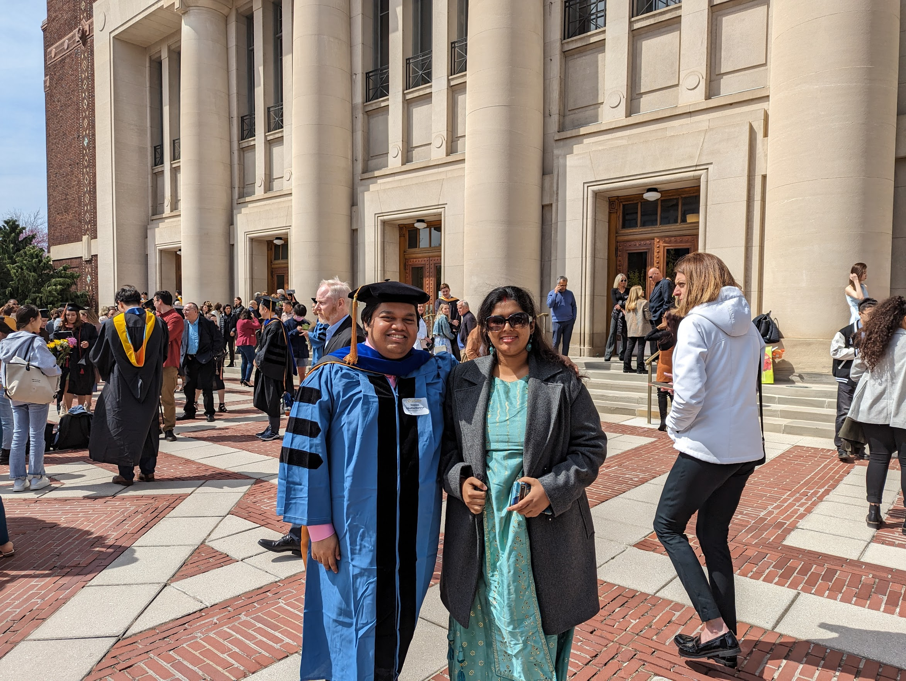

<br>

```{r out.width = "50%", fig.align = "center", echo = FALSE}

```

<br>

Here is an overview of my academic career and teaching activities. For more details on these, please take a look at my [CV](https://bit.ly/rbCV).

## Education

- **PhD in Biostatistics**, University of Michigan, 2018 - 2023.
  - Dissertation: [Bayesian Models for Multi-omic Multi-system Integration for Precision Oncology](https://deepblue.lib.umich.edu/handle/2027.42/177797).
- **Master of Statistics**, Indian Statistical Institute, Kolkata, 2016-2018.
  - Specialization: Applied Statistics, Biostatistics track.
- **Bachelor of Statistics** (Hons.), Indian Statistical Institute, Kolkata, 2013-2016.

## Teaching

- Lecturer at the [**Big Data Summer Institute**](https://sph.umich.edu/bdsi/).
  - [Introduction to Linear Algebra](https://sph.hosted.panopto.com/Panopto/Pages/Viewer.aspx?id=4df8ac5c-a26f-4a6c-bca6-b026015bb1c5), 2023.
  - [Introduction to Linear Algebra](https://sph.hosted.panopto.com/Panopto/Pages/Viewer.aspx?id=1e37e945-7634-45a2-aba6-aebd01212e07), 2022.
  - [Introduction to Probability](https://sph.hosted.panopto.com/Panopto/Pages/Viewer.aspx?id=f29a5ab0-4ff9-451c-b29e-ad400048d11b), 2021.
- Grader and project reviewer in departmental courses.
  - Biostat 651: Theory and Application of Generalized Linear Models, Winter 2023.
  - Biostat 651: Theory and Application of Generalized Linear Models, Winter 2021.
  - Biostat 802: Advanced Inference II, Winter 2020.
