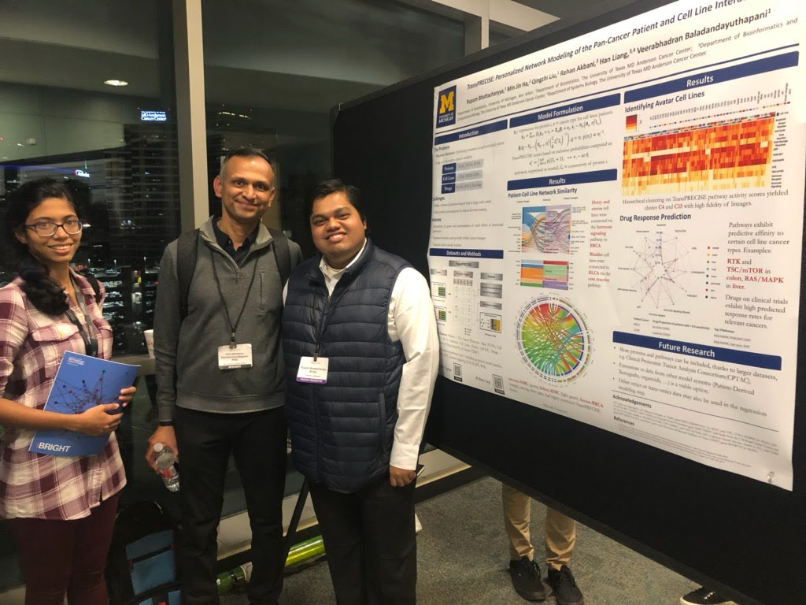

<br>

```{r out.width = "50%", fig.align = "center", echo = FALSE}

```

<br>

Below is a list of my published projects (in descending order of publication year) and upcoming conference presentations. Please refer to my [CV](https://drive.google.com/file/d/1EaBT63r_Bf7c6FvuQL7TphOHW0GLYQit/view?usp=sharing), [Researchgate profile](https://www.researchgate.net/profile/Rupam-Bhattacharyya) or [Google Scholar page](https://scholar.google.com/citations?user=D5F2V4YAAAAJ&hl=en) to get a complete list of my preprints, ongoing projects, past presentations and accolades. My CV also contains the most updated list of my administrative and peer review activities.

## Published Works

- **Bhattacharyya, R.**, Banerjee, S., Mohammed, S., \& Baladandayuthapani, V. (2021). Network-based modeling of COVID-19 dynamics: early pandemic spread in India. *Journal of the Indian Statistical Association*, to appear.

- Purkayastha, S., **Bhattacharyya, R.**, Bhaduri, R., Kundu, R., Gu, X., Salvatore, M., ... \& Mukherjee, B. (2021). A comparison of five epidemiological models for transmission of SARS-CoV-2 in India. *BMC infectious diseases*, 21(1), 1-23.

- **Bhattacharyya, R.**, Kundu, R., Bhaduri, R., Ray, D., Beesley, L. J., Salvatore, M., \& Mukherjee, B. (2021). Incorporating false negative tests in epidemiological models for SARS-CoV-2 transmission and reconciling with seroprevalence estimates. *Scientific Reports*, 11(1), 1-14.

- Ray, D., **Bhattacharyya, R.**, \& Mukherjee, B. (2021). Discussion on “The timing and effectiveness of implementing mild interventions of COVID-19 in large industrial regions via a synthetic control method” by Tian et al. *Statistics and Its Interface*, 14(1), 25-28.

- Salvatore, M., Basu, D., Ray, D., Kleinsasser, M., Purkayastha, S., **Bhattacharyya, R.**, \& Mukherjee, B. (2020). Comprehensive public health evaluation of lockdown as a non-pharmaceutical intervention on COVID-19 spread in India: national trends masking state-level variations. *BMJ Open*, 10(12), e041778.

- Ray, D., Salvatore, M., **Bhattacharyya, R.**, Wang, L., Du, J., Mohammed, S., ... \& Mukherjee, B. (2020). Predictions, role of interventions and effects of a historic national lockdown in India’s response to the COVID-19 pandemic: data science call to arms. *Harvard Data Science Review*, 2020(Suppl 1).

- **Bhattacharyya, R.**, Ha, M. J., Liu, Q., Akbani, R., Liang, H., \& Baladandayuthapani, V. (2020). Personalized network modeling of the pan-cancer patient and cell line interactome. *JCO Clinical Cancer Informatics*, 4, 399-411.

- Liu, Q., Ha, M. J., **Bhattacharyya, R.**, Garmire, L., \& Baladandayuthapani, V. (2020, January). Network-based matching of patients and targeted therapies for precision oncology. In *Pacific Symposium on Biocomputing* (Vol. 25, No. 2020, pp. 623-634).

## Upcoming Presentations

- Functional Integrative Bayesian Analysis of High-dimensional Multi-platform Genomic Data.
  - World Meeting of the International Society for Bayesian Analysis, March 2022.
  - Eastern North American Region International Biometric Society Spring Meeting, June 2022.