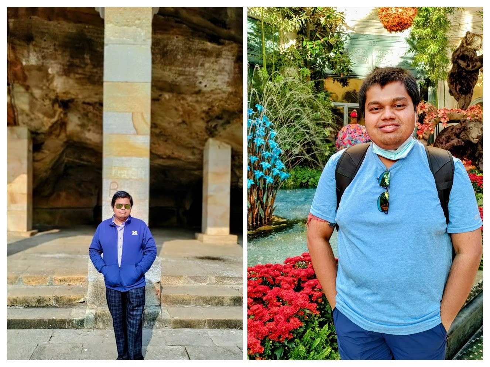

<br>

```{r out.width = "50%", fig.align = "center", echo = FALSE}

```

<br>

## Popular Science and Media Activities

In addition to my formal academic ventures, I strive to make the science I work on more accessible and user-friendly to people not necessarily trained in my discipline. Here are a few examples of my efforts:

- **YouTube Tutorials**
  - Available on the [BayesRx YouTube channel](https://www.youtube.com/channel/UCiw6hgV17lpZUhCLGcwgkKg/videos).

- **Interactive Dashboards**
  - [Pan-cancer proteomic pathway networks](https://bayesrx.shinyapps.io/TransPRECISE/).
  - [Functional integrative analysis of proteogenomic cancer data](https://bayesrx.shinyapps.io/fiBAG/).
  - [Multi-platform evidence synthesis in multi-system cancer samples](https://bayesrx.shinyapps.io/BaySyn/).
  - [Estimation of immunogenic modulation in clinicogenomic cancer models](https://bayesrx.shinyapps.io/GPVIBES/).
  - [Network-based modeling of the COVID-19 pandemic in India](https://bayesrx.shinyapps.io/COV-N/).
  - [National forecasts of COVID-19 in India](https://umich-biostatistics.shinyapps.io/covid19/).

- **Media Interactions**
  - [Newstalk](https://www.newstalk.com/podcasts/highlights-from-moncrieff/1-3-billion-lockdown-india).
  - [The World](https://www.pri.org/stories/2020-03-25/without-support-indias-poorest-people-lockdown-risks-failure).
  - [The Guardian](https://www.theguardian.com/world/2020/mar/24/indias-13bn-population-locked-down-to-beat-coronavirus).
  - [NDTV India](https://drive.google.com/file/d/1Xt4LjmNJsXsUVTTXop6AgQWwjFKxcvcS/view?usp=sharing).
  - [The Wire](https://thewire.in/health/covid-19-india-national-data-state).

- Recently, I have ventured into writing popular science articles in my mother tongue, Bengali. One of my pieces on approaching data science and statistics as a potential career path was published during the 2023 Kolkata International Book Fair in a collection called \textit{Bigyaner Jogot} aimed primarily at pre-college teens across West Bengal, India.

## My World and Hobbies

Apart from spending time with my work and my family, I love watching all kinds of sports (with a slight predilection towards football - not the American kind!), listening to a broad range of Indian and world music, reading basically any literature that I can get my hands on, and last but not least, *quizzing*. The one place where I share my thoughts on a recent book I am reading, or the latest game I watched is my [Facebook profile](https://www.facebook.com/rupam.bhattacharyya1995/) (I do have Twitter and Instagram, but am really inactive there!).
